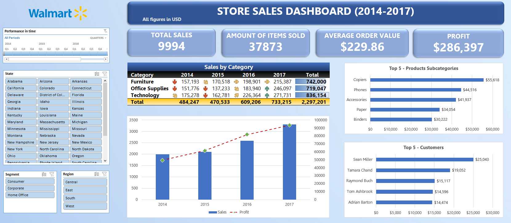

# Excel Dashboard: Ventas de Walmart

## Objetivo

El objetivo principal de este proyecto es demostrar la capacidad de realizar un dashboard interactivo en Microsoft Excel para visualizar KPIs a lo largo del tiempo. El dashboard provee observaciones en ventas de una tienda norteamericana genérica en un período de tiempo de 3 años (2014-2017).

## Herramientas usadas

- **Microsoft Excel:** Tablas dinámicas, gráficos, formato condicional, slicers.
- **Limpieza de datos:** Texto a columnas, filtros, uso de formato de tabla.
- **Visualización de datos:** Diseño de dashboard interactivo para realizar un seguimiento de las ventas, las ganancias, las categorías de productos y el nivel de compra de los clientes.

El dataset utilizado fue extraído de [Kaggle](https://www.kaggle.com/datasets/vivek468/superstore-dataset-final).

## Dashboard

*(!) - Para abrir el dashboard debe descargar el archivo aquí:*     [Ventas_Walmart](Ventas_Walmart.xlsx)

## Principales KPIs

- **Total de Ventas:** Recuento de la cantidad de ventas. Ayuda a evaluar el rendimiento general de la empresa.
- **Cantidad de unidades vendidas:** Indica la cantidad total de ítems vendidos, lo que permite conocer la demanda de los clientes y el volumen de ventas.
- **Average Order Value (AOV):** Es una métrica utilizada para medir la cantidad media que los clientes gastan por pedido durante un determinado período de tiempo. El monitoreo de los cambios en el AOV ayuda a identificar los cambios en el comportamiento de compra de los clientes, lo que permite mejorar las estrategias de precios.
- **Ganancias:** El total de las ganancias generadas por las ventas. Constituye una métrica financiera clave que revela la rentabilidad de la tienda y sus operaciones.
- **Ventas por categoría:** Las tendencias de ventas desglosadas por categoría de producto (mobiliario, material de oficina, tecnología). Esto ayuda a identificar qué categorías de productos crecen o decrecen con el tiempo.
- **Principales subcategorías de productos:** Este KPI muestra las subcategorías de productos con mayores ingresos (por ejemplo, impresoras, teléfonos, accesorios). Revela qué productos específicos contribuyen más a las ventas.
- **Mejores clientes:** Identifica a los clientes que más invierten en nuestros productos.
- **Ventas por región/estado:** Mide el rendimiento de las ventas geográficamente, lo que permite a la tienda realizar un seguimiento de los estados o regiones más rentables.

## Conclusiones

- Desde 2014 hasta 2017, las ventas aumentaron más del **50%** demostrando una **trayectoria creciente** en todos los años. Esto puede indicar que las operaciones de la tienda y los esfuerzos de marketing han sido exitosos en este lapso de tiempo.
- **"Tecnología"** fue la categoría con más contribución de ventas, constituyendo el **36.4%** de los ingresos totales, reflejando una fuerte demanda de productos tecnológicos durante este período.
- Las **impresoras** (copiers) fueron la subcategoría que generó la ganancia más alta, contribuyendo con **$55.618**. Este dato resalta la importancia estratégica de enfocarse en este producto que tiene un margen de ganancia amplio.
- **Sean Miller** fue el mejor cliente, contribuyendo **$25.043** en ventas. La tienda podría implementar una iniciativa dirigida a los mejores clientes, como una tarjeta de lealtad con una serie de incentivos para que repitan compras, por ejemplo brindando **descuentos exclusivos**. Estas estrategias de marketing personalizadas podrían ayudar a aumentar la tasa de retención de clientes, la fidelidad de los mismos y potencialmente incluso impulsar las ventas totales.
